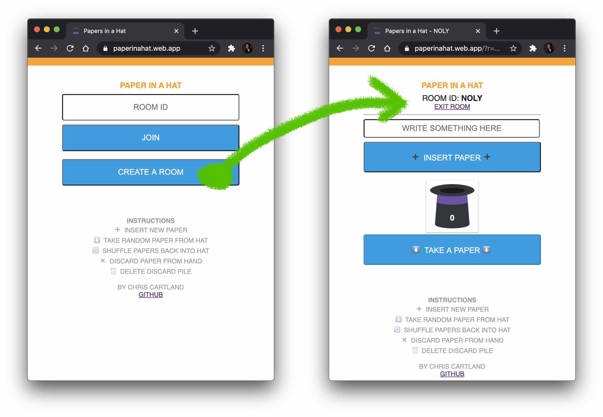
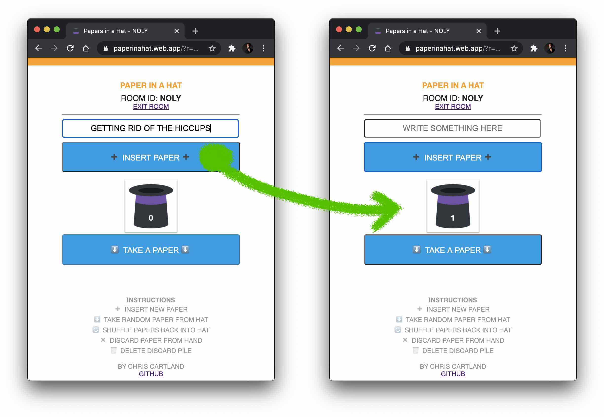
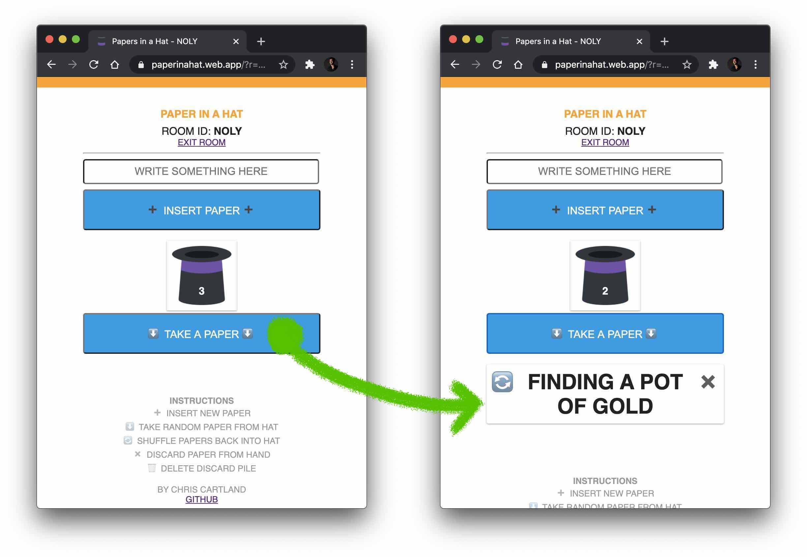
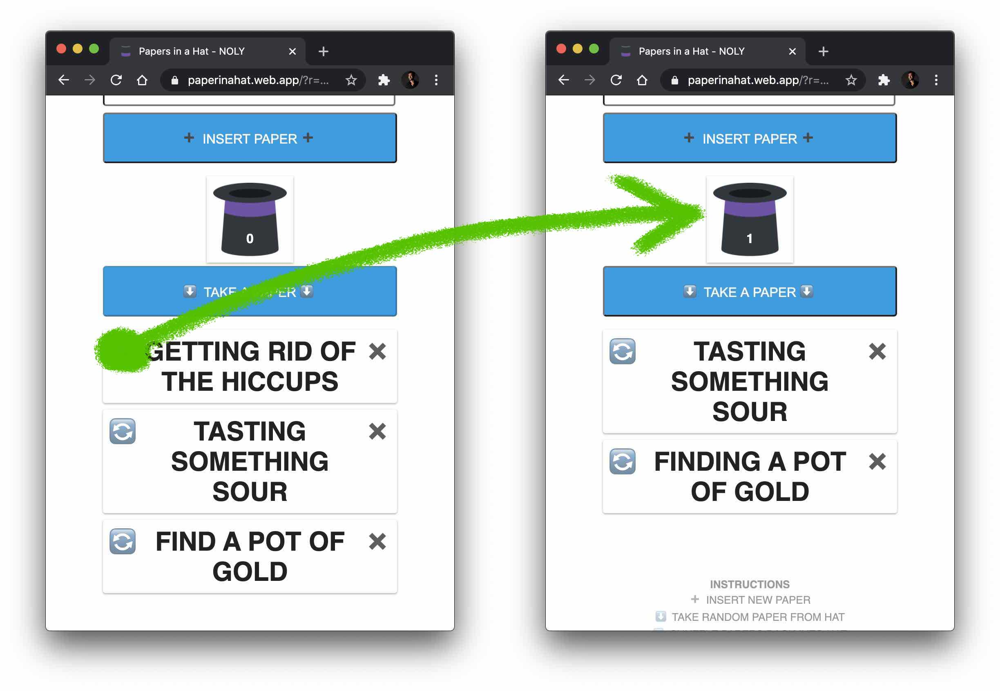
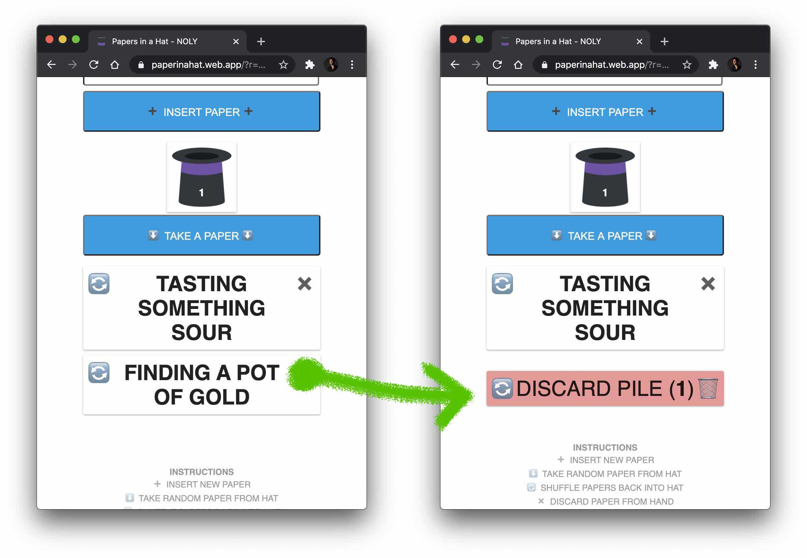
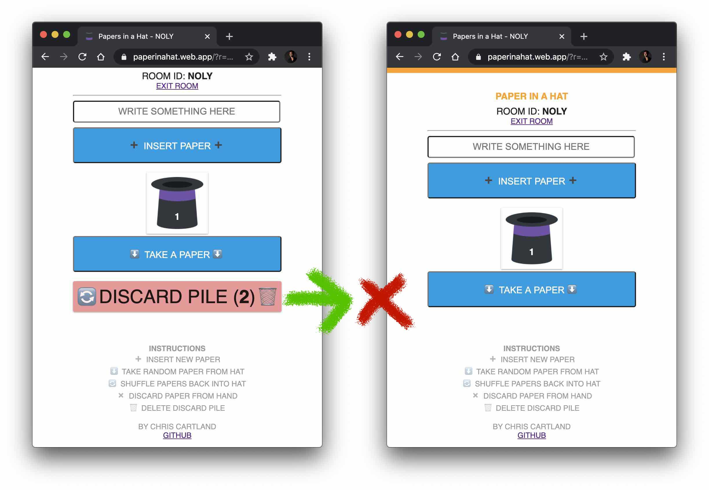

# Paper in a Hat
[_Paper in a Hat_](https://paperinahat.web.app) allows you to
create a virtual room for people to contribute ideas and take one at random.
This can be used for games like charades, even if people are on a video call
in different places.

## Create a Room
* Go to https://paperinahat.web.app and tap "Create a Room".

## Share the Room
* Share the room ID with other people so they can join your room.
* You can also share the URL so people do not need to type the room ID.

## Insert a Paper
* Type something in the text field and tap "Insert Paper".
* The number on the hat shows how many papers are in the hat.

## Take a Paper
* Tap the hat in order to take a paper.
* You can hold multiple papers in your hand.

## Shuffle a Paper
* Tap the shuffle icon to return a paper to the hat.

## Discard a Paper
* Tap the discard icon to discard a paper in your hand.

## Delete Discard Pile
* Tap the delete icon to delete all papers in your discard pile.
* Note: If you close the browser window, all papers in your hand or in your discard pile will be deleted.

# Appendix
* This web app is available at 2 URLs. People can use either URL.
  * https://paperinahat.firebaseapp.com
  * https://paperinahat.web.app
