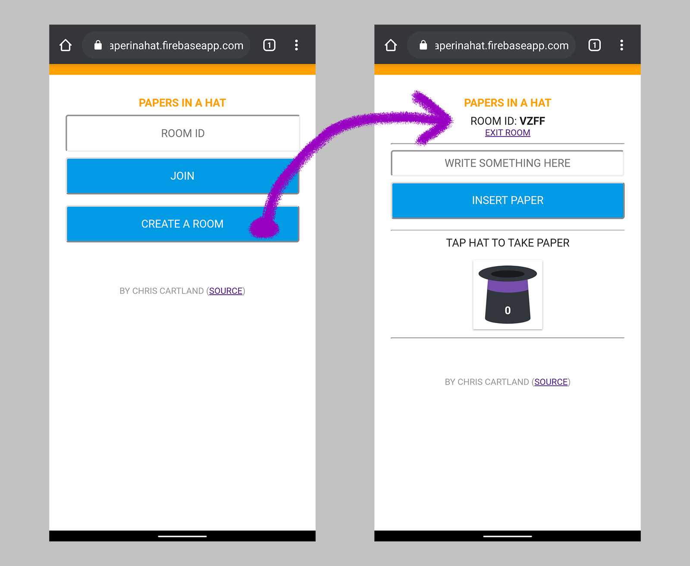
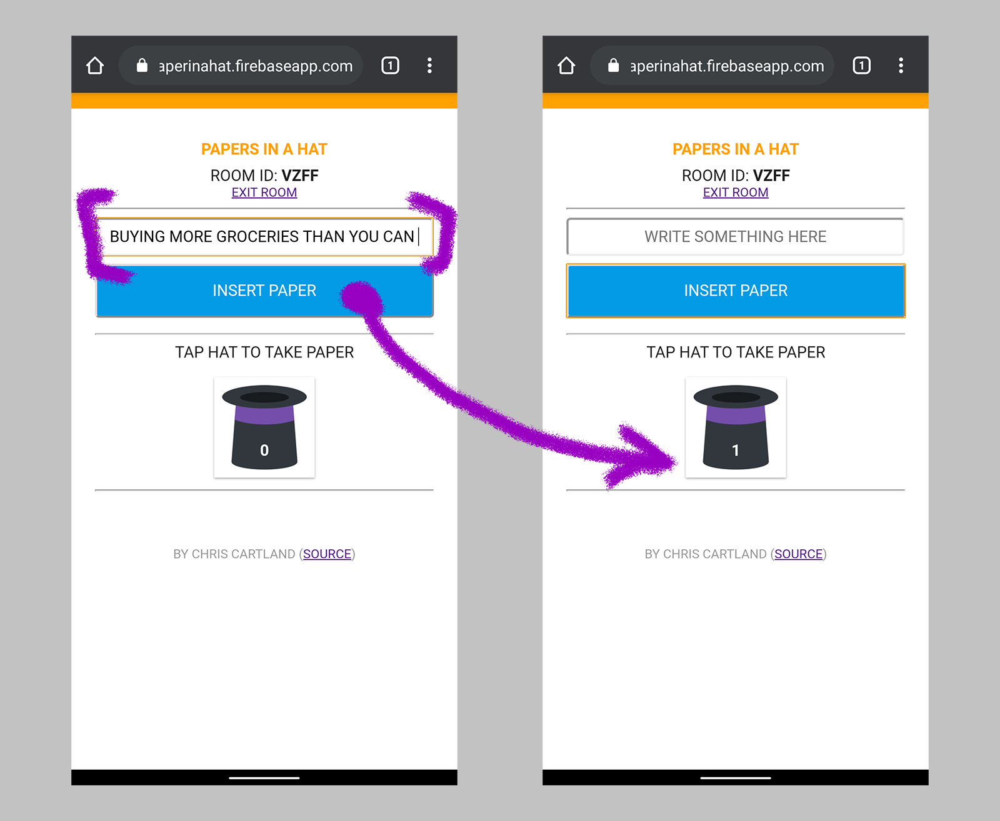
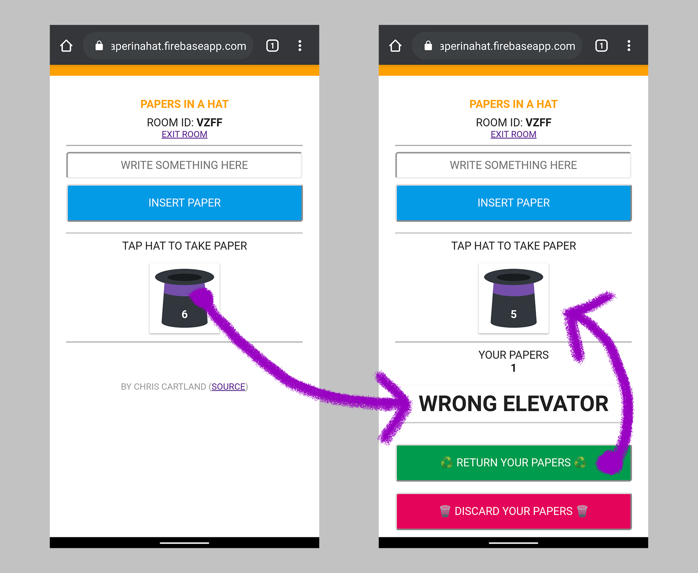

# Paper in a Hat
[_Paper in a Hat_](https://paperinahat.firebaseapp.com) allows you to
create a virtual room for people to contribute ideas and take one at random.
This can be used for games like charades, even if people are on a video call
in different places.

## Create a Room
* Go to https://paperinahat.firebaseapp.com and tap "Create a Room".

## Share the Room
* Share the room ID with other people so they can join your room.
* You can also share the URL so people do not need to type the room ID.

## Insert a Paper
* Type something in the text field and tap "Insert Paper".
* The number on the hat shows how many papers are in the hat.

## Take a Paper
* Tap the hat in order to take a paper.

## Manage the papers in your hand
* You can hold multiple papers in your hand.
* You can return all your papers by pressing the "Return Your Papers" button.
 * These papers will be shuffled back into the hat.
* You can discard all your papers by pressing the "Discard Your Papers" button.
* If you close the browser window, papers in your hand will be discarded.

