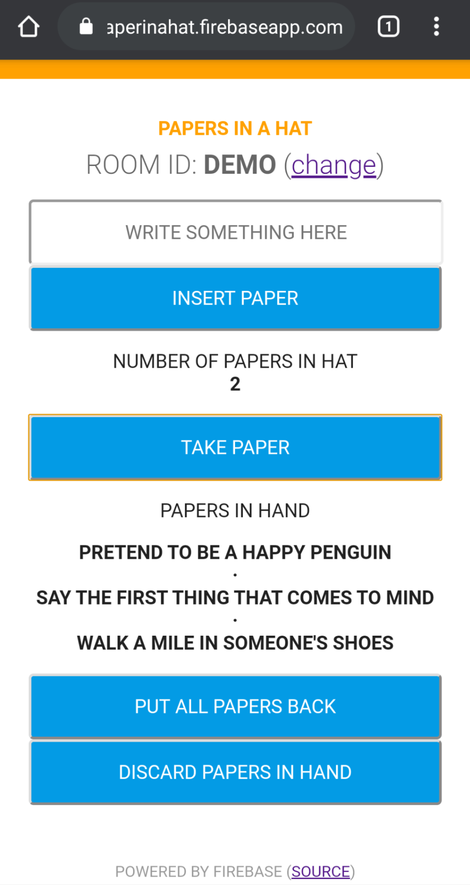

# Papers in a Hat
Online tool for people to put papers in a virtual hat and then draw them at random.

# Use the app
You can try the app yourself by going to this URL:
https://paperinahat.firebaseapp.com/

After you enter a room, you can share the URL with other people. You can also type in the meeting ID.

